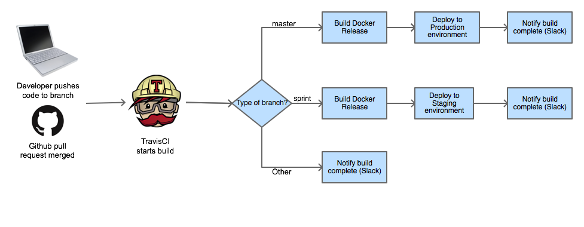

# Continuous Integration/Continuous Deployment

_Consider the Following_ is structured to allow easy integration into a CI/CD environment. We chose [TravisCI](https://travis-ci.org/BridgePhase/ctf/builds) as our CI platform. Travis also allows us to perform our deployments to our AWS instances using [Amazon Code Deploy](http://aws.amazon.com/codedeploy/).

## Integration and Deployment Process

One of the goals in the implementation of this application was to create a real CI/CD process where we could push code to a `master` branch and see it in production in a matter of minutes. In order to accomplish this we had the following guidelines:

1. The application must be easily deployable by anyone
2. The application must allow for anyone to run the tests at any point in time
3. The application must allow for continuous deployments from validated builds automatically
4. The application must be able to be deployed to multiple environments automatically

Integrating the repository with TravisCI and AWS CodeDeploy allowed us to accomplish these tasks.

TravisCI orchestrates the build, storage, tagging of releases, and initiates the deployment of artifacts. AWS CodeDeploy orchestrates the deployment of those artifacts into our various environments. Take a look at the `.travis.yml` file to see details on how TravisCI manages our deployments.

_Consider the Following_ uses 2 AWS EC2 instances for the production (`master`) deployments and one AWS EC2 instance for Staging (`sprint_*` branches) deployments. These instances act as our application servers (by deploying our Docker images). The Docker image itself however is built by yet another EC2 instance whose sole purpose is to build Docker artifacts and publish them to our [Docker hub repository](https://registry.hub.docker.com/u/jramirez/bridgephase/tags/manage/#). The configuration of these instances was made possible by the creation of an Amazon Machine Image (AMI) with the default settings. This allows us to create new instances if needed in a very rapid manner (a matter of a few minutes).

Our deployments were created through AWS Code Deploy by setting up three deployment groups (one for production, one for staging, and one to build Docker images). In order to prevent downtime to our application during a production deployment, the production deploy group is configured to deploy to half our instances at a time (since we only have 2, it deploys to one at a time). The 2 production EC2 instances are load balanced so that during deployments, the production application can remain alive. 

Following this strategy, we are able to have deployments to our production environment in an average of 6 minutes from a merge into the `master` branch.  

This diagram shows the whole deployment process:
