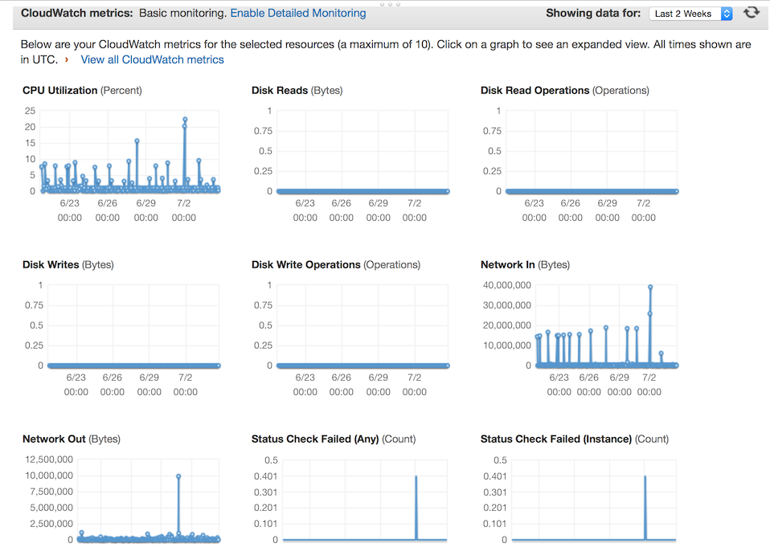
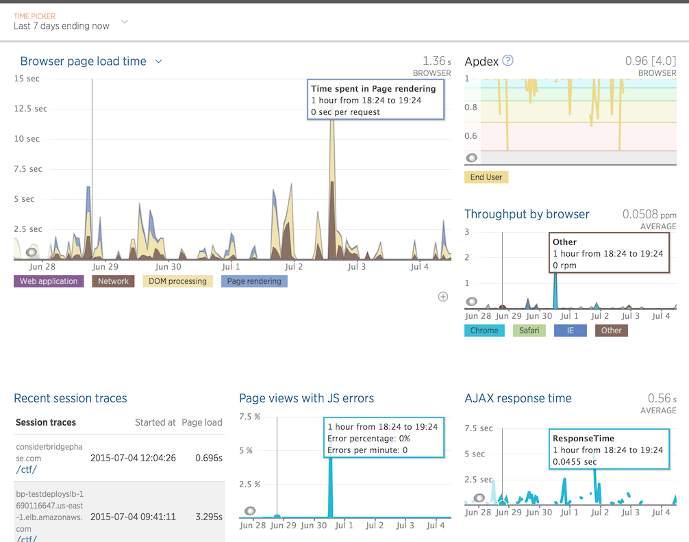

# Monitoring Consider the Following

In _Consider the Following_ we have two different types of monitoring tools set up. The first one is provided out-of-the-box by using Amazon's EC2 instances and provides system monitoring and alerting. System monitoring is useful because it can be used to scale EC2 depending on demand. 

The second type of monitoring we implemented was [New Relic's Browser](http://newrelic.com/browser-monitoring) based monitoring. This type of monitoring gave us insight into our page load times, Ajax response time and network throughput. We used these metrics to ensure our application behaved in an optimal manner. These statistics led to the implementation of caching strategies and the minification/concatenation of CSS and JavaScript resources. The metrics show that our browser page load time averages 1.36 seconds to load the average page. 

